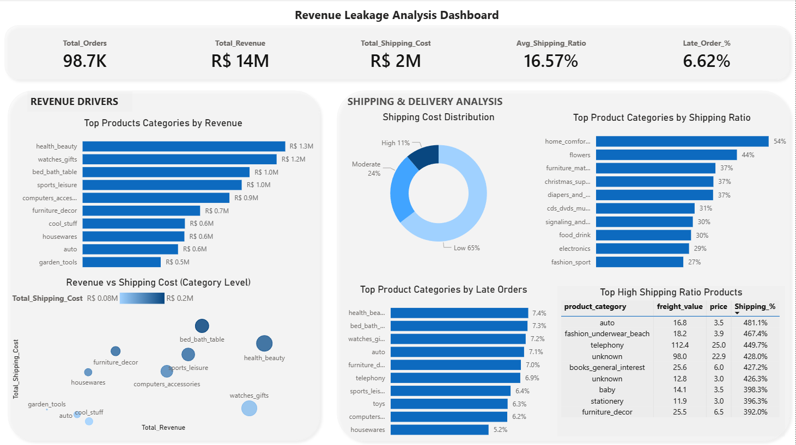
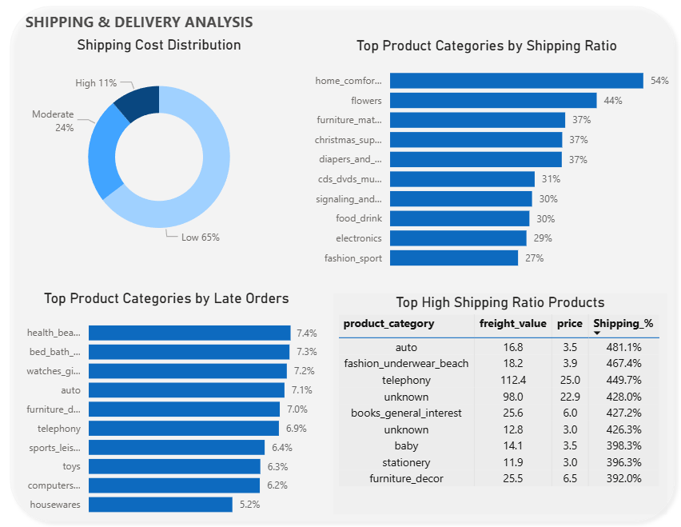
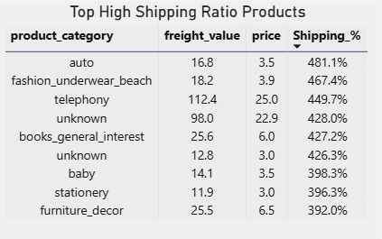

# Revenue Leakage Analysis

## Project Overview

This project is based on analyzing revenue leakage in an e-commerce dataset. The main idea was to understand where money is getting **lost** due to high shipping costs, inefficient pricing, or delivery issues.

The project covers the full workflow — from raw data cleaning to building a final dashboard in Power BI.

## Objective
The analysis is driven by the following key questions:
- What percentage of orders have a high shipping cost?
- Which product categories have the highest shipping ratio?
- What percentage of orders are delivered late?
- Which product categories have the most late deliveries?
- Which product categories contribute the most to revenue leakage due to shipping?

## Dataset Used
The **Olist Brazilian E-commerce dataset** was used, focusing on the following tables:
- orders
- order_items
- products
- product_category_name_translation

After cleaning and merging, the final dataset created was: 
**orders_pruducts_final** table.

## Data Cleaning & Preparation using (Python - Pandas)

Key steps performed:
- Checked for duplicate records and handled missing values
- Merged multiple tables into a single cleaned dataset
- Translated product categories from Portuguese to English
- Fixed data types for accurate analysis
- Missing categories were labeled as **Unknown** instead of removing them

To analyze shipping and delivery inefficiency, some new columns were created:
- **shipping_ratio** = freight_value / price
- A **high_shipping** flag to identify problematic orders
- **delivery_delay** indicator using delivery timestamps
- **delivery_days** to calculate delivery duration

## Tools Used
- Python (Pandas) = Data cleaning and preparation
- MySQL = Data analysis using SQL queries
- Power BI = Dashboard and visualization
- MS-Excel = Handling raw csv files.

## Dashboard Preview

### Overview

### 🔹 Shipping & Delivery Analysis

### 🔹 High Shipping Products

## Key Insights  
- Approximately **3.4% of total orders** fall under the high shipping cost category, indicating a small but important segment contributing to potential revenue leakage
- Some product categories consistently show higher shipping ratios compared to others, especially where product price is relatively low
- Low-cost products tend to have **very high shipping ratios**, which makes them less efficient from a profitability perspective
- Approximately **6.6% of orders were delivered late**, which can negatively impact customer experience
- A small group of categories contributes more to overall shipping cost, suggesting that revenue leakage is not evenly distributed
- The presence of **Unknown** category highlights missing data in the source dataset, which can affect analysis quality

## Recommendations
- Optimize shipping strategy for categories with high shipping ratios
- Re-evaluate pricing for low-cost products with high shipping costs
- Improve logistics planning to reduce the **6.6% late deliveries**
- Focus on high shipping cost orders (around **3.4% of total orders**) as they contribute to potential revenue leakage
- Investigate **Unknown** category data to improve overall data quality

## Author
Pooja
